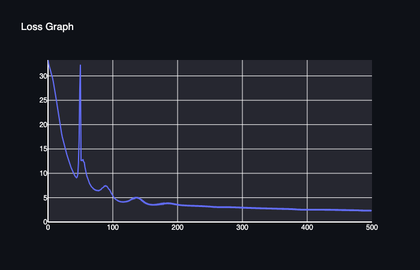
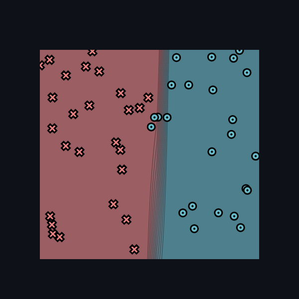
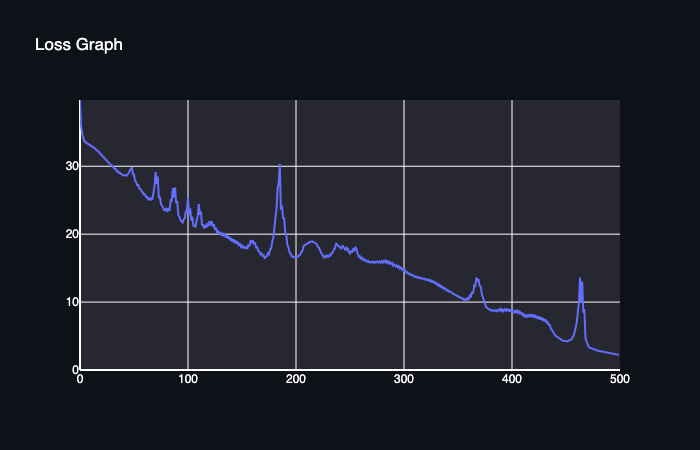
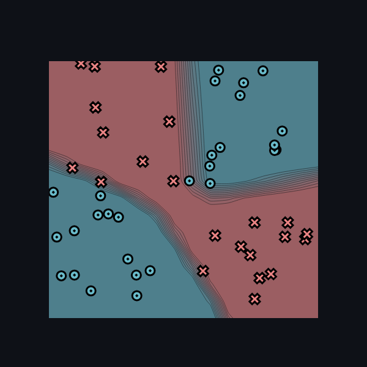

[](https://classroom.github.com/online_ide?assignment_repo_id=16455150&assignment_repo_type=AssignmentRepo)
# MiniTorch Module 1


* Docs: https://minitorch.github.io/

* Overview: https://minitorch.github.io/module1/module1/

This assignment requires the following files from the previous assignments. You can get these by running

```bash
python sync_previous_module.py previous-module-dir current-module-dir
```

The files that will be synced are:

        minitorch/operators.py minitorch/module.py tests/test_module.py tests/test_operators.py project/run_manual.py

## Training (Task 1.5)
### Simple Dataset Output
The model was trained on the `Simple` dataset with 50 points, a hidden layer of 2 neurons, and a learning rate of 0.5.

#### Logs
```
Epoch  10  loss  33.52406793659556 correct 28
Epoch  20  loss  32.746623082744556 correct 34
Epoch  30  loss  31.241153834170948 correct 46
Epoch  40  loss  28.152702726858692 correct 47
Epoch  50  loss  21.481415125076293 correct 47
Epoch  60  loss  13.75221468443107 correct 49
Epoch  70  loss  10.227203040272366 correct 50
Epoch  80  loss  8.072371463068594 correct 50
Epoch  90  loss  6.5728276497407325 correct 50
Epoch  100  loss  5.527551309782154 correct 50
Epoch  110  loss  8.504339635107533 correct 45
Epoch  120  loss  8.381313073879133 correct 45
Epoch  130  loss  4.181987146823523 correct 50
Epoch  140  loss  3.5926362385847797 correct 50
Epoch  150  loss  3.2101940331196417 correct 50
Epoch  160  loss  2.8983890800942707 correct 50
Epoch  170  loss  2.7014264273977355 correct 50
Epoch  180  loss  3.7440632890385155 correct 50
Epoch  190  loss  5.507249969296617 correct 46
Epoch  200  loss  6.945038640436942 correct 45
Epoch  210  loss  2.2838913973584614 correct 50
Epoch  220  loss  1.9682155833489294 correct 50
Epoch  230  loss  1.8150266472970031 correct 50
Epoch  240  loss  1.6842736627264303 correct 50
Epoch  250  loss  1.5685860639609663 correct 50
Epoch  260  loss  1.4655176392146518 correct 50
Epoch  270  loss  1.3738693598299982 correct 50
Epoch  280  loss  1.2929848256680039 correct 50
Epoch  290  loss  1.2207608494394255 correct 50
Epoch  300  loss  1.1553585400684183 correct 50
Epoch  310  loss  1.095757384922521 correct 50
Epoch  320  loss  1.0412246709373443 correct 50
Epoch  330  loss  0.9911738500748221 correct 50
Epoch  340  loss  0.9451126001479657 correct 50
Epoch  350  loss  0.9026180916073856 correct 50
Epoch  360  loss  0.863323673780383 correct 50
Epoch  370  loss  0.826908623465617 correct 50
Epoch  380  loss  0.7930911184331655 correct 50
Epoch  390  loss  0.7616226916606941 correct 50
Epoch  400  loss  0.7322836731899954 correct 50
Epoch  410  loss  0.7048793615742271 correct 50
Epoch  420  loss  0.6802101172373619 correct 50
Epoch  430  loss  0.6565393334202713 correct 50
Epoch  440  loss  0.6348699536093907 correct 50
Epoch  450  loss  0.6144146765144602 correct 50
Epoch  460  loss  0.5950799654204167 correct 50
Epoch  470  loss  0.5767817851656348 correct 50
Epoch  480  loss  0.5594442118044668 correct 50
Epoch  490  loss  0.543440707500386 correct 50
Epoch  500  loss  0.5281479619549809 correct 50
```

#### Decision Boundary


#### Loss Graph


### Xor Dataset Output
The model was trained on the `Xor` dataset with 50 points, a hidden layer of 10 neurons, and a learning rate of 0.5.

#### Logs
```
Epoch  10  loss  34.51395022547874 correct 26
Epoch  20  loss  33.99261056796896 correct 27
Epoch  30  loss  33.44558824104017 correct 27
Epoch  40  loss  32.88153382583739 correct 27
Epoch  50  loss  32.2673452884714 correct 31
Epoch  60  loss  31.70267830255279 correct 33
Epoch  70  loss  31.055503721321493 correct 36
Epoch  80  loss  30.300955998006536 correct 37
Epoch  90  loss  29.516623430262335 correct 37
Epoch  100  loss  28.834281200773937 correct 37
Epoch  110  loss  27.876830986896376 correct 37
Epoch  120  loss  26.73517411648452 correct 37
Epoch  130  loss  25.493627607938542 correct 38
Epoch  140  loss  24.64359013539475 correct 40
Epoch  150  loss  23.36140930171668 correct 40
Epoch  160  loss  22.049417477977755 correct 41
Epoch  170  loss  22.226790726833045 correct 40
Epoch  180  loss  20.559995638158835 correct 41
Epoch  190  loss  20.36643160020145 correct 41
Epoch  200  loss  18.08479536240018 correct 42
Epoch  210  loss  19.199684825658387 correct 40
Epoch  220  loss  17.22943295531743 correct 43
Epoch  230  loss  16.94523231053401 correct 41
Epoch  240  loss  15.878162101094478 correct 43
Epoch  250  loss  14.881055285283512 correct 43
Epoch  260  loss  14.397333321901622 correct 43
Epoch  270  loss  13.689305164470609 correct 44
Epoch  280  loss  12.518064528938007 correct 43
Epoch  290  loss  10.543200931307192 correct 45
Epoch  300  loss  9.280640268855306 correct 46
Epoch  310  loss  9.483370924451249 correct 46
Epoch  320  loss  9.445036097494194 correct 46
Epoch  330  loss  12.607397544759085 correct 44
Epoch  340  loss  10.931424259234122 correct 46
Epoch  350  loss  8.129447758261872 correct 48
Epoch  360  loss  10.186168481269853 correct 45
Epoch  370  loss  7.483741170996708 correct 48
Epoch  380  loss  8.28180932481644 correct 47
Epoch  390  loss  7.61053665675079 correct 48
Epoch  400  loss  11.149186753797236 correct 45
Epoch  410  loss  5.273336528849604 correct 50
Epoch  420  loss  9.01559162202781 correct 45
Epoch  430  loss  7.7982166089480645 correct 47
Epoch  440  loss  11.388819479427703 correct 45
Epoch  450  loss  4.353736153397436 correct 50
Epoch  460  loss  9.994089244411777 correct 45
Epoch  470  loss  7.7754930306541405 correct 46
Epoch  480  loss  6.134301958862707 correct 47
Epoch  490  loss  6.288219607277138 correct 46
Epoch  500  loss  5.8971693913571785 correct 47
```

#### Decision Boundary


#### Loss Graph
